# Universidad de San Carlos de Guatemala

- **Facultad de Ingeniería**
- **Escuela de Ciencias y Sistemas (ECYS)**
- **Prácticas Iniciales - Sección C**

---
- **Nombre**: Josué Javier Carrera Soyós
- **Carné**: 202300834
- **Fecha**: 20 de agosto de 2026

---
# MANUAL TÉCNICO: INTRODUCCION A LINUX Y ENTORNOS EN LA NUBE

El presente reporte documenta las actividades realizadas durante la práctica inicial de Linux, que abarcan desde la instalación del sistema operativo hasta el uso de la terminal y la configuración de un servicio web. En primer lugar se describe el proceso de instalación de Ubuntu 24.04 mediante virtualización; posteriormente se presenta una guía con los comandos básicos de la terminal; y finalmente se desarrolla una actividad práctica donde se instala y administra el servidor web Apache2.

A lo largo de todo el reporte se hace uso de la **terminal**, una herramienta clave en Linux que permite ejecutar tareas escribiendo comandos en lugar de utilizar interfaces gráficas. Muchos de estos comandos requieren privilegios de administrador, por lo que en ocasiones deben ejecutarse antecedidos por **`sudo`**, palabra que otorga temporalmente permisos de superusuario (root) para poder modificar el sistema, instalar software o editar archivos protegidos.

## Objetivos

### Objetivo General
- Comprender y dominar los fundamentos de la administración de sistemas operativos basados en Linux mediante el aprovisionamiento de un entorno virtualizado de Ubuntu y la interacción directa con la interfaz de línea de comandos (CLI).

### Objetivos Específicos
- Desarrollar de manera práctica destrezas en la navegación del sistema de archivos, la gestión estructurada de directorios y la manipulación de elementos desde la terminal, asimilando conceptos sobre enlaces simbólicos, tipos de rutas y permisos lógicos.
- Implementar, configurar y validar un servidor web Apache2 en el entorno local, administrando correctamente el estado del servicio y personalizando el contenido mediante la edición segura de archivos del sistema a través de la terminal.

## 1. Entorno de instalación.

**Descripción**: Instalación del sistema operativo Linux, específicamente Ubuntu 24.04, mediante virtualización sobre VirtualBox.

Para esta primera práctica se llevó a cabo la instalación del sistema operativo Ubuntu en su versión 24.04. La instalación se realizó de forma virtualizada, es decir, sin intervenir en el sistema operativo anfitrión, utilizando el hipervisor VirtualBox. A continuación se detalla el procedimiento completo.

### 1.1 Descarga de la imagen ISO de Ubuntu

El primer paso consistió en acceder al sitio web de descargas de Ubuntu, en la siguiente ruta: [https://releases.ubuntu.com/](https://releases.ubuntu.com/).

Para ello:

- Se accedió a la página por medio de un navegador web.
- En la página se muestra un listado con todas las versiones anteriores disponibles de Ubuntu.
- Para esta práctica se seleccionó la versión **Ubuntu 24.04 LTS**.
- Desde esta página se descargó el archivo de instalación, conocido como **ISO**.

> **¿Qué es una imagen ISO?** Es un archivo que contiene una copia exacta de todo el contenido de un disco, en este caso el medio de instalación del sistema operativo. Sirve como "plantilla" a partir de la cual se instala Ubuntu en la máquina virtual.

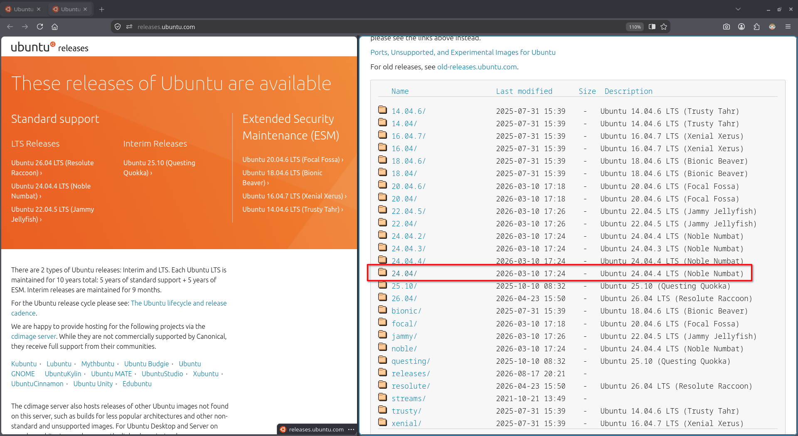

### 1.2 Descarga e instalación de VirtualBox

Posteriormente se procedió a descargar VirtualBox desde su sitio web oficial: [https://www.virtualbox.org/](https://www.virtualbox.org/).

- **VirtualBox** es un hipervisor, es decir, un software que permite crear y ejecutar máquinas virtuales, simulando un equipo completo (procesador, memoria, disco, etc.) dentro de otro sistema.
- Se encuentra disponible para los principales sistemas operativos: Windows, Linux y macOS.
- En esta práctica se utiliza la virtualización como medio para instalar y probar Ubuntu sin afectar al sistema principal.

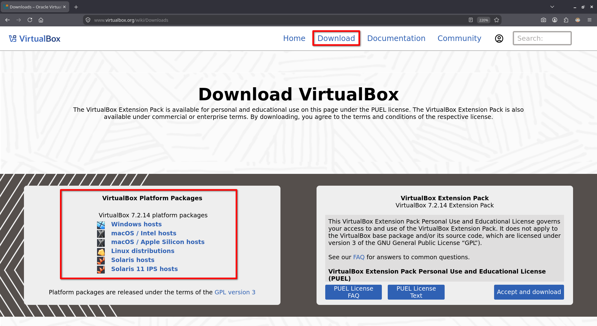

### 1.3 Creación de una nueva máquina virtual

Una vez instalado VirtualBox, se abrió la aplicación y se hizo clic en el botón **"New"**, el cual se encuentra señalado en color rojo en la imagen. Este botón permite crear una nueva máquina virtual desde cero.

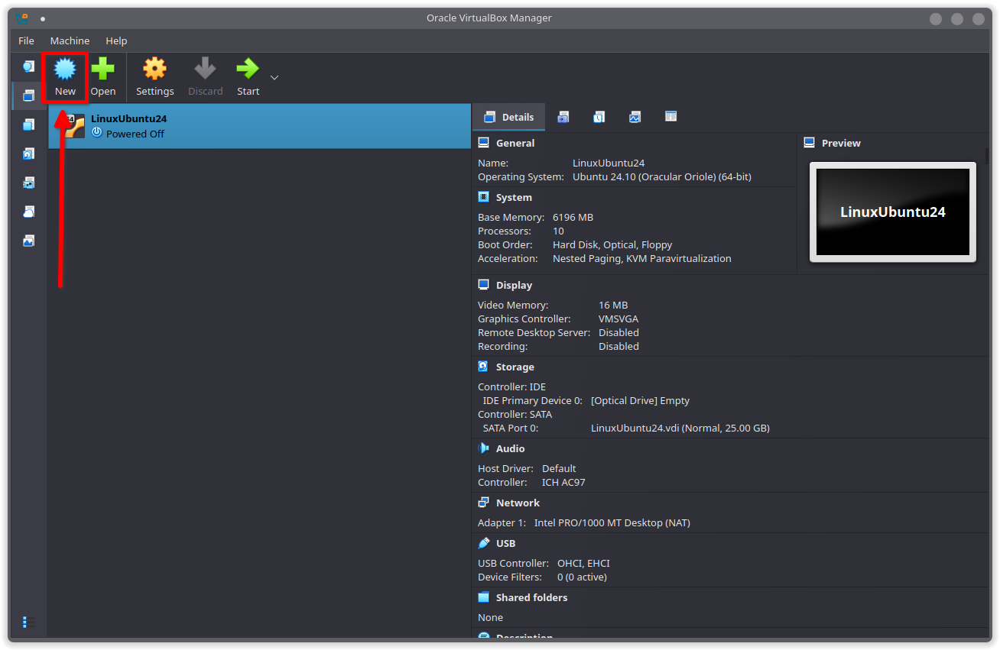

Al presionar el botón se despliega un asistente de configuración compuesto por varias secciones, que se detallan a continuación.

#### 1.3.1 Nombre y sistema operativo de la máquina virtual

En la sección *Virtual Machine Name and Operating System* se definen los datos de identificación del equipo virtual:

- **VM Name**: nombre que se le asigna a la máquina virtual (por ejemplo, "Ubuntu24").
- **VM Folder**: carpeta donde se almacenarán los archivos de la máquina virtual.
- **ISO Image**: se selecciona la imagen ISO de Ubuntu 24.04 descargada anteriormente.
- **Proceed with Unattended Installation**: opción marcada que permite automatizar la instalación del sistema, evitando pasos manuales durante el proceso.

#### 1.3.2 Configuración automática del sistema invitado

En la sección *Set Up Unattended Guest OS Installation* se configuran las credenciales del usuario que se creará durante la instalación:

- **User Name**: nombre del usuario administrador del sistema.
- **Password** y **Confirm Password**: contraseña de acceso al sistema, ingresada dos veces para confirmarla.

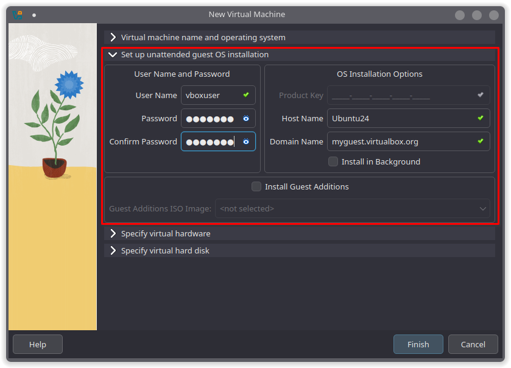

#### 1.3.3 Recursos de hardware virtual

En la sección *Specify Virtual Hardware* se asignan los recursos de hardware que tendrá la máquina virtual:

- **Base Memory**: cantidad de memoria RAM asignada al sistema virtual.
- **Number of CPUs**: número de núcleos de procesador asignados.
- **Use EFI**: opción desmarcada, por lo que se utiliza el firmware tradicional (BIOS) en lugar del modo EFI.

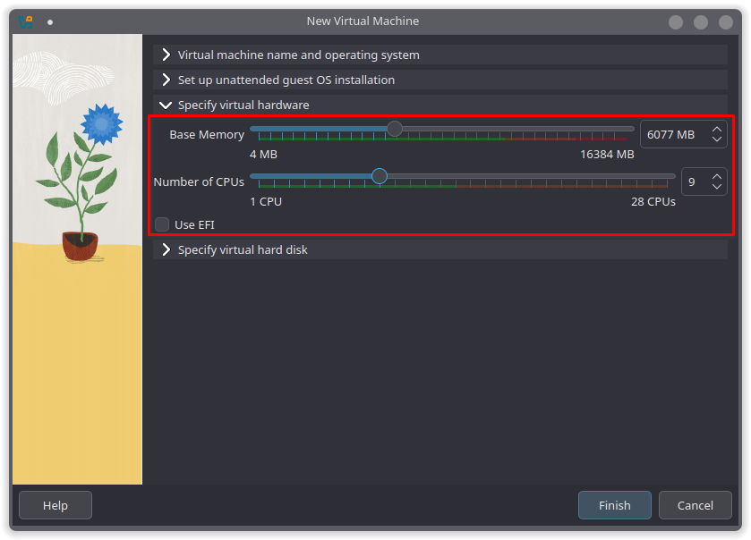

#### 1.3.4 Creación del disco duro virtual

En la sección *Create a New Virtual Hard Disk* se configura el almacenamiento:

- Se elige la opción **Create a New Virtual Hard Disk**, que genera un archivo de disco virtual donde se guardará el sistema operativo y todos sus datos.
- Tras esta configuración, se presiona el botón "**Finish**", lo cual inicializará el proceso de creación y configuración automática del entorno de la máquina virtual.

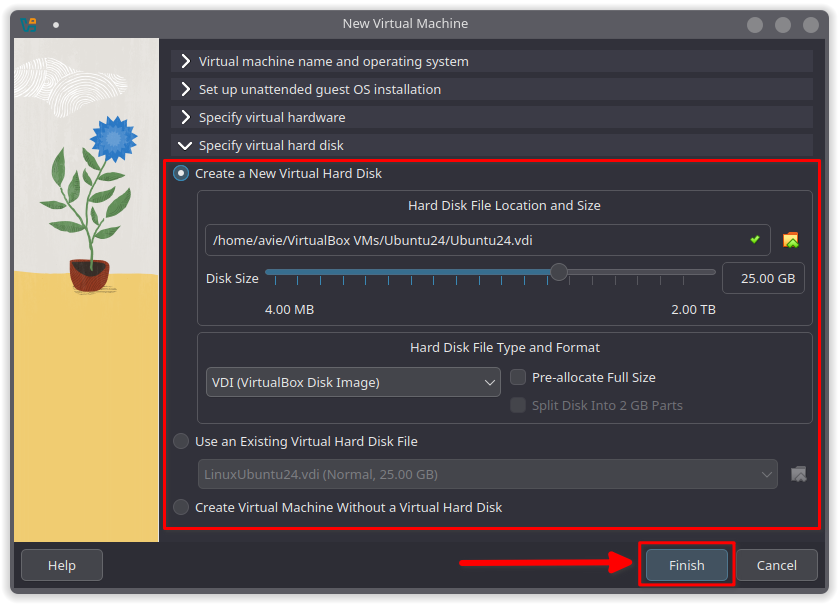

Al finalizar el proceso, se presentará el escritorio de la distribución Ubuntu, confirmando que la máquina virtual ha sido creada correctamente y se encuentra lista para su uso.

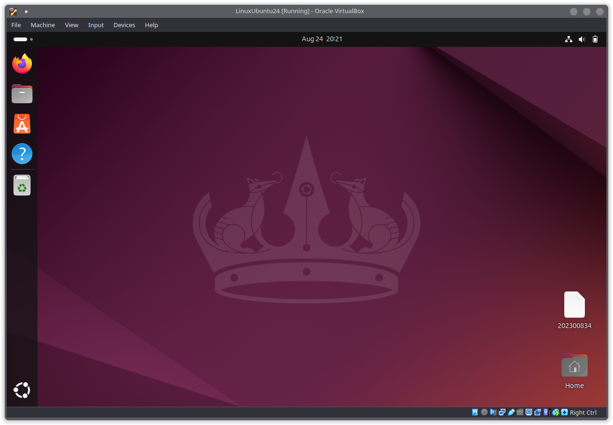
## 2. Guía De Comandos CLI

**Descripción**: Comandos básicos de la terminal en Linux, organizados por su función: navegación, listado y creación, y manipulación de archivos.

La terminal (o consola) es una herramienta fundamental en Linux, ya que permite interactuar con el sistema escribiendo comandos en lugar de hacer clic en ventanas. A continuación se presentan los comandos básicos más utilizados, agrupados según su propósito. Cada comando incluye su sintaxis, sus variaciones y un ejemplo práctico ejecutado en la terminal.

### 2.1 Comandos de navegación

#### `pwd` (Print Working Directory)

Muestra la ruta del directorio en el que el usuario se encuentra actualmente.

- **Sintaxis:** `pwd [opciones]`

**Variaciones:**

- `pwd`: Muestra la ruta del directorio actual.
- `pwd -P`: Muestra la ruta física real, resolviendo enlaces simbólicos.
- `pwd -L`: Muestra la ruta lógica, incluyendo los enlaces simbólicos.

> **Nota técnica:** Un enlace simbólico funciona como un acceso directo en otros sistemas. La opción `-P` (Physical) omite los enlaces y revela la ubicación física real en el disco, mientras que `-L` (Logical) preserva la ruta de navegación.

**Ejemplo práctico:**

Partiendo del directorio `/home/vboxuser/Desktop` se ejecutó el comando `ls` para listar el contenido, donde se identificó una carpeta denominada `Downloads` (la cual es un enlace simbólico a la carpeta de descargas del usuario).

A continuación, se realizaron las siguientes operaciones dentro de la carpeta `Downloads`:
- `pwd`: Devolvió la ruta lógica `/home/vboxuser/Desktop/Downloads`, que representa la ruta de acceso al enlace simbólico.
- `pwd -P`: Devolvió la ruta física real `/home/vboxuser/Downloads`, resolviendo la ubicación exacta en el sistema de archivos, omitiendo el enlace.

> **Diferencia técnica:** El comando `pwd` por defecto opera en modo lógico (`-L`), mostrando la ruta tal como fue accedida. Al utilizar la opción `-P` (Physical), el sistema interpreta el enlace simbólico y muestra la ruta del directorio destino real en el disco.

#### `cd` (Change Directory)

Permite cambiar de directorio dentro del sistema de archivos.

- **Sintaxis:** `cd [directorio]`

**Variaciones:**

- `cd`: Cambia al directorio personal del usuario (`/home/usuario`).
- `cd ~`: Igual a `cd`, lleva al directorio personal.
- `cd ..`: Sube un nivel en el árbol de directorios.
- `cd -`: Regresa al directorio anterior donde se estaba ubicado.
- `cd /ruta/absoluta`: Navega directamente utilizando la ruta completa desde la raíz `/`.

> **Concepto clave:** Las rutas **absolutas** inician siempre desde la raíz `/` (ej. `/home/vboxuser/Desktop`), mientras que las rutas **relativas** parten desde el directorio actual de trabajo (ej. `Desktop/Tarea`).

**Ejemplo práctico:**

Partiendo del directorio `/home/vboxuser/` se ejecutaron los siguientes comandos:
- `cd Desktop/`: ingresó al subdirectorio `Desktop`.
- `cd ..`: subió un nivel, regresando a `/home/vboxuser/`.
- `cd Desktop/Tarea/`: navegó directamente a la carpeta `Tarea` ubicada dentro de `Desktop`, usando una ruta relativa.
- `cd`: sin argumentos, regresó al directorio personal `/home/vboxuser/`.

### 2.2 Comandos de listado y creación

#### `ls` (List)

Lista los archivos y carpetas contenidos en un directorio.

- **Sintaxis:** `ls [opciones] [directorio/archivo]`

**Variaciones:**

- `ls`: Lista archivos y carpetas del directorio actual.
- `ls -l`: Muestra el listado en formato detallado (permisos, propietario, tamaño y fecha).
- `ls -a`: Lista todos los archivos, incluidos los ocultos (aquellos que empiezan con `.`).
- `ls -lh`: Muestra los detalles con tamaños legibles para humanos (KB, MB, GB).
- `ls -la`: Combina el formato largo con la visualización de archivos ocultos.

> **Nota técnica:** En el formato detallado (`-l`), el primer carácter indica el tipo de elemento (`-` para archivo regular y `d` para directorio), seguido por la cadena de permisos de lectura (`r`), escritura (`w`) y ejecución (`x`) para el propietario, grupo y otros usuarios.

**Ejemplo práctico:**

Estando en `/home/vboxuser/` se ejecutaron los comandos `ls`, `ls -l` y `ls -a`:
- `ls`: listó los archivos y carpetas del directorio actual.
- `ls -l`: mostró el listado en formato detallado (permisos, propietario, tamaño y fecha de modificación).
- `ls -a`: listó todos los archivos, incluidos los ocultos (los que comienzan con `.`).

Luego se ejecutaron los comandos `ls -lh` y `ls -la`:
- `ls -lh`: mostró el listado detallado con los tamaños en formato legible para humanos (KB, MB, GB).
- `ls -la`: combinó el formato largo con la visualización de los archivos ocultos.

#### `mkdir` (Make Directory)

Crea uno o más directorios (carpetas).

- **Sintaxis:** `mkdir [opciones] nombre_directorio`

**Variaciones:**

- `mkdir carpeta`: Crea un único directorio.
- `mkdir carpeta1 carpeta2`: Crea múltiples directorios a la vez.
- `mkdir -p ruta/de/carpetas/anidadas`: Crea un árbol completo de directorios anidados, incluyendo los padres si aún no existen.
- `mkdir -v carpeta`: Muestra un mensaje detallado por cada directorio creado.

**Ejemplo práctico:**

Desde la ruta `/home/vboxuser/Desktop`, se ejecutó primeramente el comando `ls` para inspeccionar el directorio, confirmando únicamente la presencia del archivo `202300834`.

A continuación, se realizaron los procedimientos de creación de directorios:
- `mkdir Tarea`: Creó un directorio individual llamado `Tarea`.
- `mkdir -v Actividades Presentaciones`: Creó simultáneamente dos carpetas (`Actividades` y `Presentaciones`), imprimiendo un mensaje descriptivo en consola por cada directorio generado.
- `mkdir -p Usac/Practicas/Reportes`: Creó una estructura jerárquica de subcarpetas anidadas de forma automática mediante la opción `-p` (parents).

Para finalizar, se ejecutaron comandos `ls` en las rutas creadas para verificar la correcta estructura del árbol de directorios.

### 2.3 Comandos de manipulación de archivos

#### `cp` (Copy)

Copia archivos o directorios de un lugar a otro.

- **Sintaxis:** `cp [opciones] origen destino`

**Variaciones:**

- `cp archivo.txt copia.txt`: Copia un archivo en el mismo u otro directorio.
- `cp -r carpeta1/ carpeta2/`: Copia una carpeta con todo su contenido de forma recursiva.
- `cp -i origen destino`: Pide confirmación antes de sobrescribir si el archivo destino existe.
- `cp -v origen destino`: Muestra en pantalla el progreso de lo que se está copiando.

**Ejemplo práctico:**

Ubicados en el directorio `/home/vboxuser/Desktop`, inicialmente se ejecutó `ls` para verificar el contenido existente, identificando el archivo simple `202300834` y la carpeta `Reporte` (la cual contenía un archivo en su interior).

Posteriormente, se realizaron las siguientes operaciones:
- `cp -v 202300834 202300834-copy`: Generó una copia del archivo simple, mostrando en la consola la confirmación del proceso gracias a la opción `-v` (verbose).
- `cp -r Reporte/ Reporte-copy/`: Copió la carpeta `Reporte` y todo su contenido de forma recursiva hacia un nuevo directorio denominado `Reporte-copy`.
- `ls Reporte-copy/`: Permitió comprobar que la estructura interna y los archivos contenidos en la carpeta original fueron duplicados de manera exitosa.

#### `mv` (Move)

Mueve archivos o directorios, y también se utiliza para renombrarlos.

- **Sintaxis:** `mv [opciones] origen destino`

**Variaciones:**

- `mv viejo.txt nuevo.txt`: Renombra un archivo o carpeta.
- `mv archivo.txt /ruta/destino/`: Mueve un archivo a otro directorio.
- `mv -i origen destino`: Solicita confirmación antes de sobrescribir.
- `mv -n origen destino`: No sobrescribe ningún archivo existente en el destino.

**Ejemplo práctico:**

Partiendo del directorio `/home/vboxuser/Desktop`, se ejecutó el comando `ls` para verificar los elementos disponibles, observando el archivo `202300834` y la carpeta vacía `Reporte`.

Luego se realizaron las siguientes acciones:
- `mv 202300834 Reporte/`: Trasladó el archivo `202300834` hacia la carpeta destino `Reporte`.
- `ls`: Permitió corroborar que el archivo original ya no figuraba en la ruta actual (`Desktop`).
- `ls Reporte/`: Confirmó la reubicación exitosa del archivo dentro de la carpeta `Reporte`.

#### `rm` (Remove)

Elimina archivos o directorios.

- **Sintaxis:** `rm [opciones] archivo/directorio`

**Variaciones:**

- `rm archivo.txt`: Elimina un archivo regular.
- `rm -r carpeta/`: Elimina una carpeta y todo su contenido de forma recursiva.
- `rm -f archivo`: Fuerza la eliminación sin pedir confirmación ni mostrar advertencias.
- `rm -rf carpeta/`: Fuerza la eliminación recursiva de un directorio completo.

**Ejemplo práctico:**

Estando ubicados en `/home/vboxuser/Desktop`, se comprobó con `ls` la existencia del archivo `202300834` y del directorio `Reporte` (el cual contenía un archivo interno).

A continuación, se llevaron a cabo los siguientes pasos:
- `rm 202300834`: Eliminó de forma permanente el archivo regular especificado.
- `ls`: Sirvió para confirmar que el archivo `202300834` había sido removido del directorio actual.
- `ls Reporte/`: Verificó el contenido existente dentro de la carpeta antes de su eliminación.
- `rm -r Reporte/`: Eliminó la carpeta `Reporte` junto con todo su contenido interno de manera recursiva.
- `ls`: Confirmó de forma definitiva la eliminación total de los archivos y directorios previamente trabajados.

#### `rmdir` (Remove Directory)

Elimina directorios, con la restricción de que únicamente puede eliminar aquellos que estén vacíos.

- **Sintaxis:** `rmdir [opciones] directorio`

**Variaciones:**

- `rmdir carpeta`: Elimina un directorio únicamente si está vacío.
- `rmdir -p padre/hijo`: Elimina carpetas vacías anidadas de forma jerárquica.
- `rmdir -v carpeta`: Muestra un mensaje al procesar la eliminación.

**Ejemplo práctico:**

Partiendo del directorio `/home/vboxuser/Desktop`, se ejecutó el comando `ls` para verificar los elementos del área de trabajo, observando la carpeta `Reporte` y el directorio `Usac` (el cual contenía la subcarpeta `Practicas`).

A continuación, se realizaron los siguientes pasos:
- `ls Reporte/`: Verificó que la carpeta `Reporte` se encontraba completamente vacía.
- `ls Usac/` y `ls Usac/Practicas/`: Inspeccionaron la estructura jerárquica para corroborar que `Practicas` no contenía archivos.
- `rmdir Reporte/`: Eliminó exitosamente el directorio `Reporte` al no contener elementos.
- `rmdir -p Usac/Practicas/`: Eliminó de forma descendente la subcarpeta `Practicas` y su directorio padre `Usac`, ya que ambos quedaron vacíos en la cadena.

> **Nota:** El comando `rmdir` es aplicable exclusivamente a directorios vacíos. Para remover carpetas con contenido, es necesario recurrir a `rm -r`. Se recomienda tener precaución con comandos como `rm -rf`, ya que su ejecución elimina archivos de forma permanente sin posibilidad de recuperación.

## 3. Actividad Práctica - Servicio Apache2

**Descripción**: Actividad práctica sobre la instalación de Apache2, la gestión del servicio y una pequeña edición del archivo `index.html`, todo desde la terminal.

En esta práctica se instaló el servidor web Apache2 en Ubuntu y se modificó la página por defecto para verificar el correcto funcionamiento del servicio. Todas las acciones se realizaron desde la terminal.

### 3.1 Actualización de los repositorios del sistema

El primer paso fue actualizar la lista de paquetes disponibles en los repositorios de Ubuntu.

- **Comando utilizado:** `sudo apt update`
- **¿Qué realiza?** Descarga la información más reciente sobre los paquetes disponibles en los repositorios, de modo que el sistema sepa qué versiones actualizadas existen. Es el paso previo recomendado antes de instalar o actualizar software.

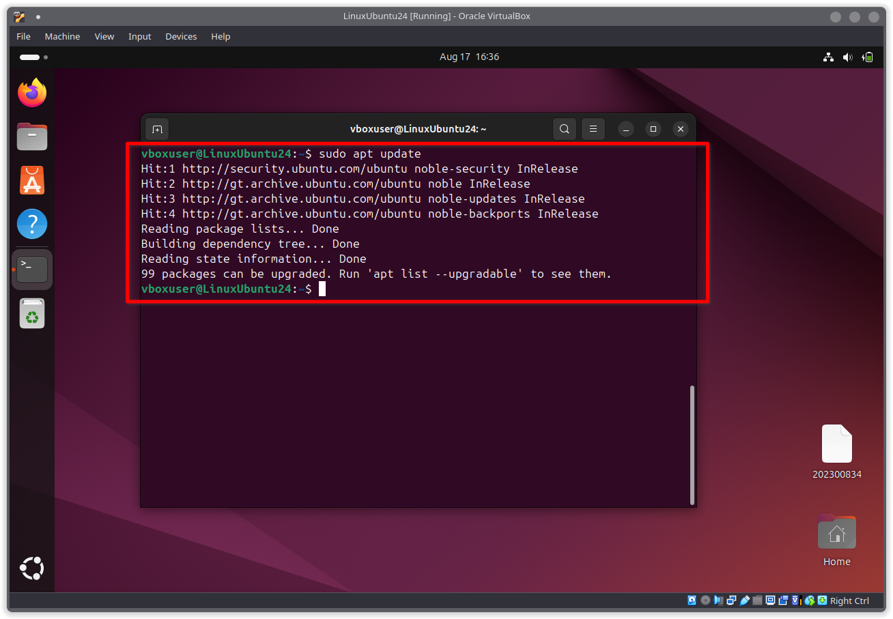

### 3.2 Actualización de los paquetes instalados

Posteriormente se actualizaron los paquetes ya instalados en el sistema.

- **Comando utilizado:** `sudo apt upgrade -y`
- **¿Qué realiza?** Aplica las actualizaciones de todos los paquetes que tengan una versión más reciente disponible. La opción `-y` responde automáticamente "sí" a cualquier confirmación, evitando la interacción manual durante el proceso.

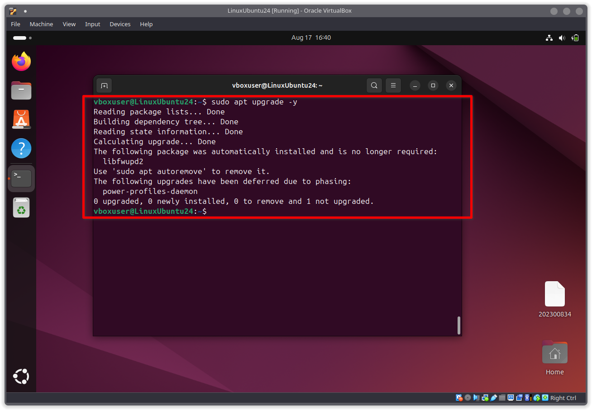

### 3.3 Instalación de Apache2

Con los repositorios actualizados, se procedió a instalar el servidor web Apache2.

- **Comando utilizado:** `sudo apt install apache2 -y`
- **¿Qué realiza?** Descarga e instala Apache2 junto con sus dependencias. Apache2 es el servidor web más utilizado en Linux: se encarga de recibir las peticiones de los navegadores y entregarles las páginas web solicitadas. La opción `-y` confirma automáticamente la instalación.

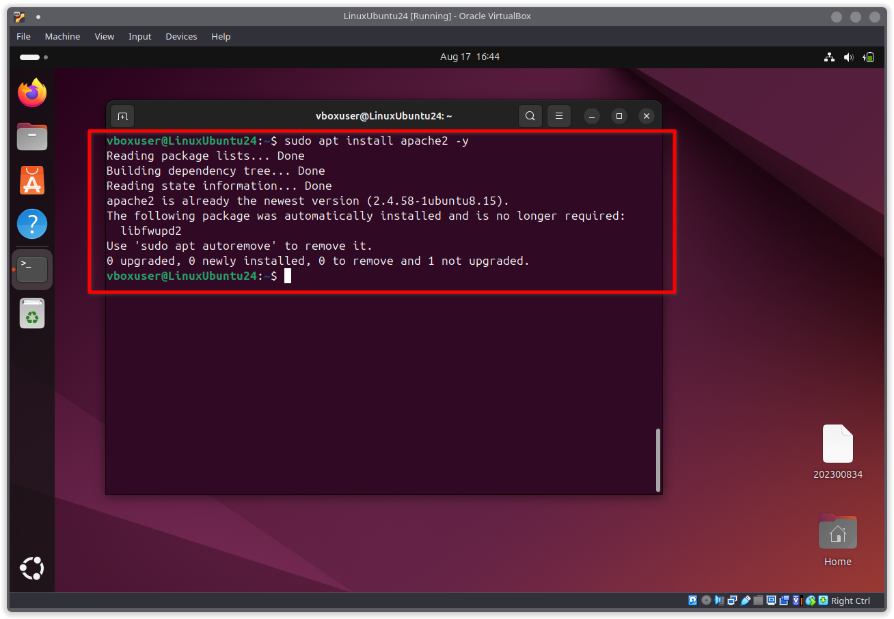

### 3.4 Verificación del estado del servicio

Para confirmar que Apache2 quedó instalado y en funcionamiento, se consultó el estado del servicio.

- **Comando utilizado:** `sudo systemctl status apache2`
- **¿Qué realiza?** Muestra el estado actual del servicio, incluyendo si se encuentra activo, sus procesos y registros recientes. Para confirmar que el servicio está encendido, se debe observar la línea `Active: active (running)`.

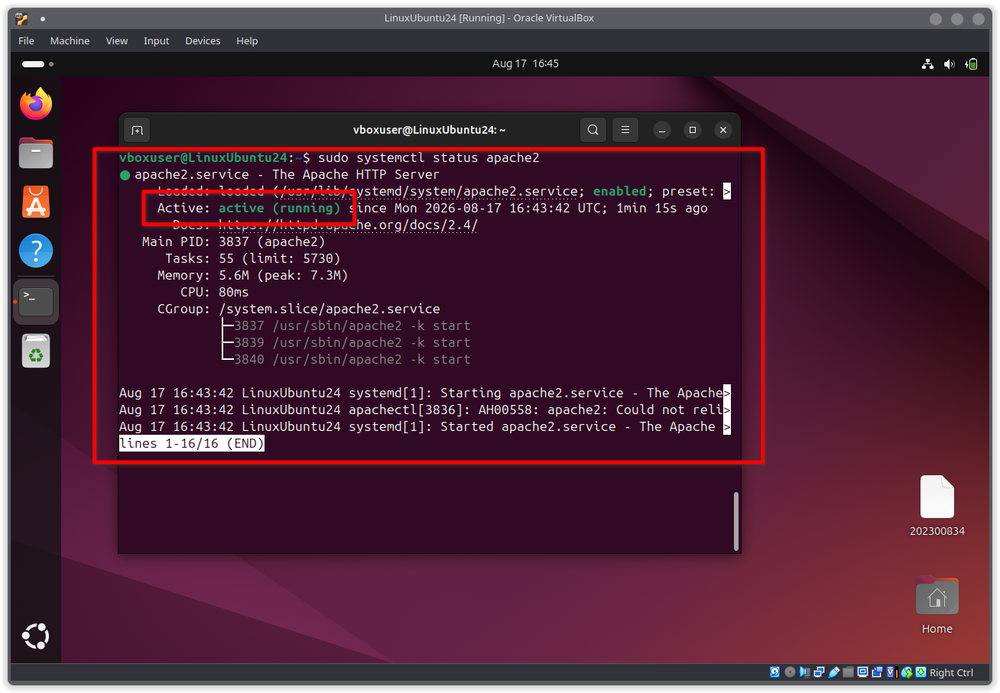

Existen además otros comandos útiles para gestionar el servicio:

- `sudo systemctl start apache2`: inicia el servicio si se encuentra detenido.
- `sudo systemctl stop apache2`: detiene el servicio.

### 3.5 Verificación en el navegador web

Como verificación de que el servidor funciona correctamente, se accedió desde el navegador web a la dirección `http://localhost`. Esta ruta apunta al propio equipo, donde el servidor Apache2 escucha las peticiones. Al ingresar, se mostró la página por defecto de Apache2, es decir, el archivo `index.html` incluido con la instalación, lo que confirma que el servicio está operando.

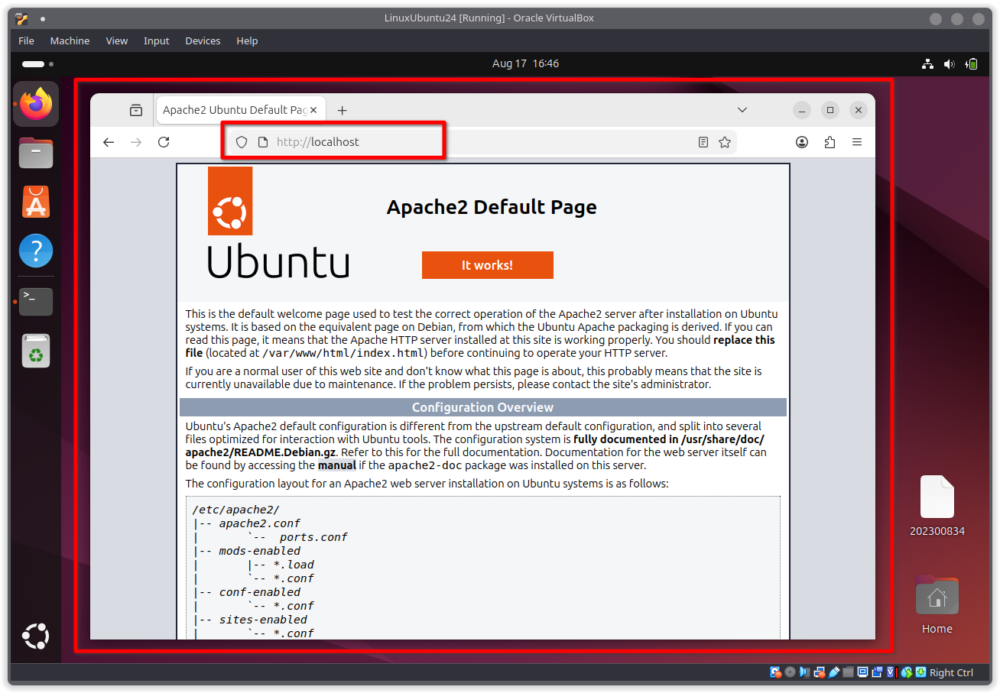

### 3.6 Acceso al directorio de archivos web

Los archivos que Apache2 sirve se encuentran en el directorio `/var/www/html/`. Para editarlos se siguió este procedimiento:

- Se accedió al directorio con el comando `cd /var/www/html/`.
- Se ejecutó `ls` para listar el contenido y se observó la presencia del archivo `index.html`.
- Se abrió el archivo con el comando `sudo nano index.html`.

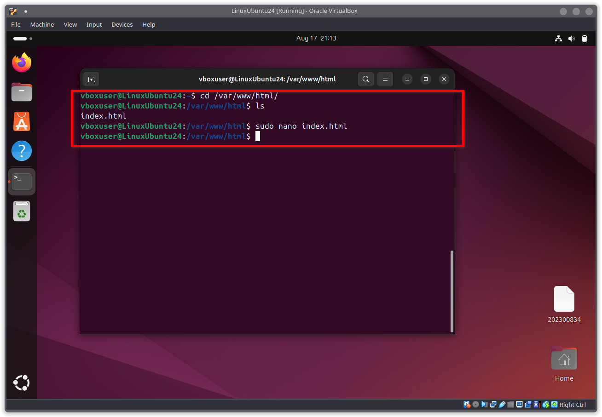

> **¿Por qué usamos `sudo`?** El directorio `/var/www/html/` pertenece al usuario *root* (administrador). Por lo tanto, para poder modificar los archivos dentro de él se necesitan privilegios elevados; sin `sudo` el sistema denegaría la edición.
>
> **¿Qué es `nano`?** Es un editor de texto sencillo que se ejecuta directamente en la terminal, ideal para editar archivos de configuración o de código sin necesidad de una interfaz gráfica.

### 3.7 Edición del archivo index.html

Al abrir el archivo con nano, se pudo ver el código HTML que generaba la página por defecto de Apache2. Este contenido fue el que se mostró en el navegador en el paso anterior. Con el editor abierto, se procedió a modificar el archivo.

> **¿Qué es HTML?** Es el lenguaje de marcado con el que se estructura el contenido de las páginas web. Mediante etiquetas (como `<h1>`, `
` o `<body>`) se definen los títulos, párrafos y demás elementos que el navegador interpreta y muestra al usuario.

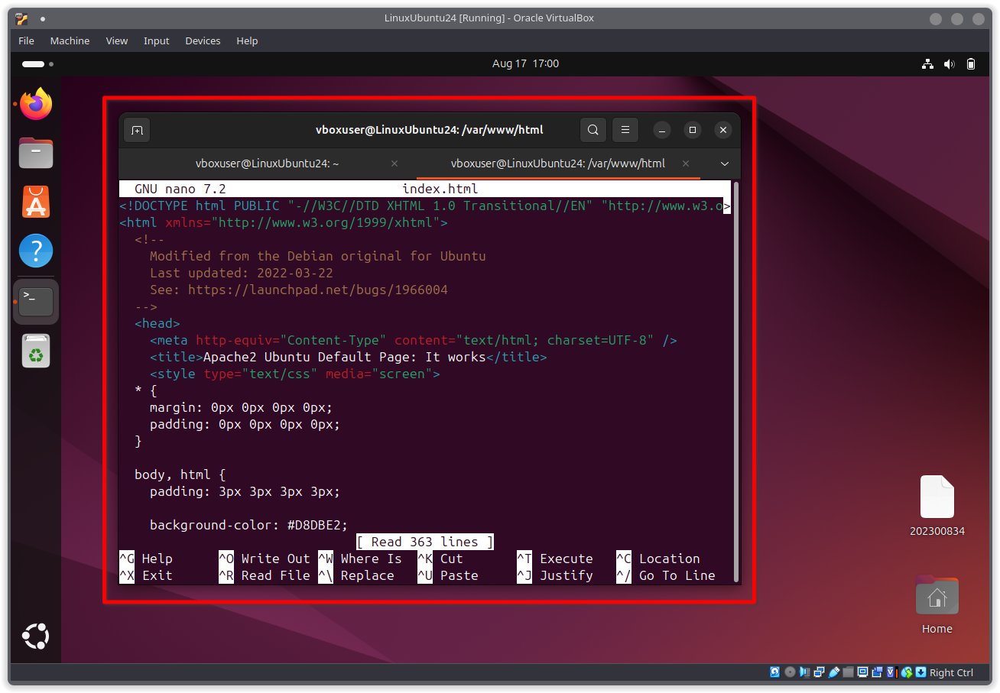

Se eliminó todo el contenido original y se reemplazó por unas líneas básicas de HTML, creando una página personalizada.

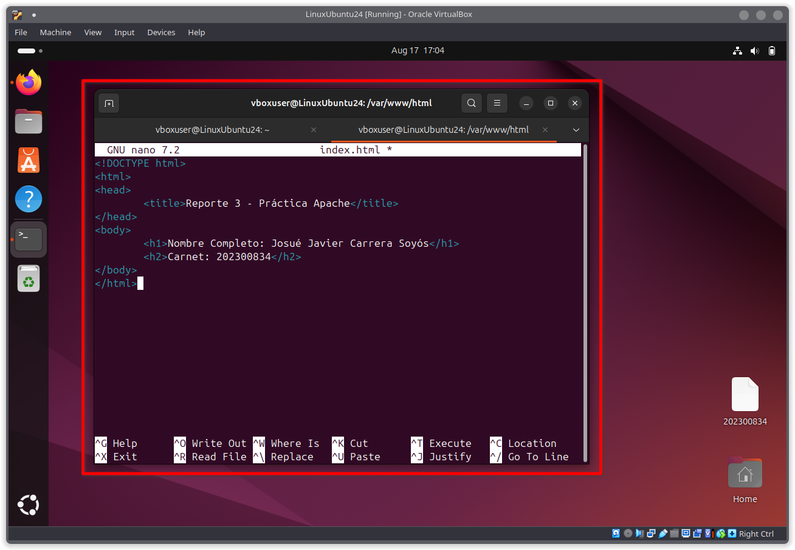

Para finalizar la edición se utilizaron los siguientes comandos de nano:

- **Guardar el archivo:** `Ctrl + O` (luego `Enter` para confirmar el nombre del archivo).
- **Cerrar el editor:** `Ctrl + X`.

### 3.8 Comprobación de los cambios

Finalmente, se accedió nuevamente a `http://localhost` desde el navegador. En esta ocasión se mostró el nuevo contenido en lugar de la página por defecto. Fue necesario recargar la página en el navegador para observar los cambios. El hecho de que el navegador muestre el contenido personalizado confirma que el archivo fue editado correctamente y que el servidor continúa funcionando de forma adecuada.

### Conclusiones

- La virtualización mediante VirtualBox permitió instalar Ubuntu 24.04 de forma aislada, sin modificar el sistema operativo anfitrión.
- El uso de la terminal y sus comandos básicos (`cd`, `ls`, `mkdir`, `cp`, `mv`, `rm`, `rmdir`) facilita la gestión del sistema de forma rápida y precisa.
- La instalación y configuración de Apache2 desde la terminal, junto con la edición del `index.html`, demostró el ciclo completo de instalación de un servicio, su verificación y su personalización.