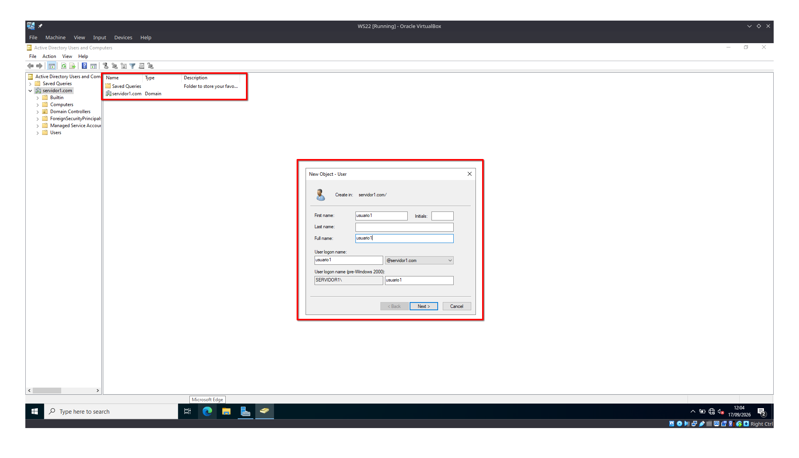
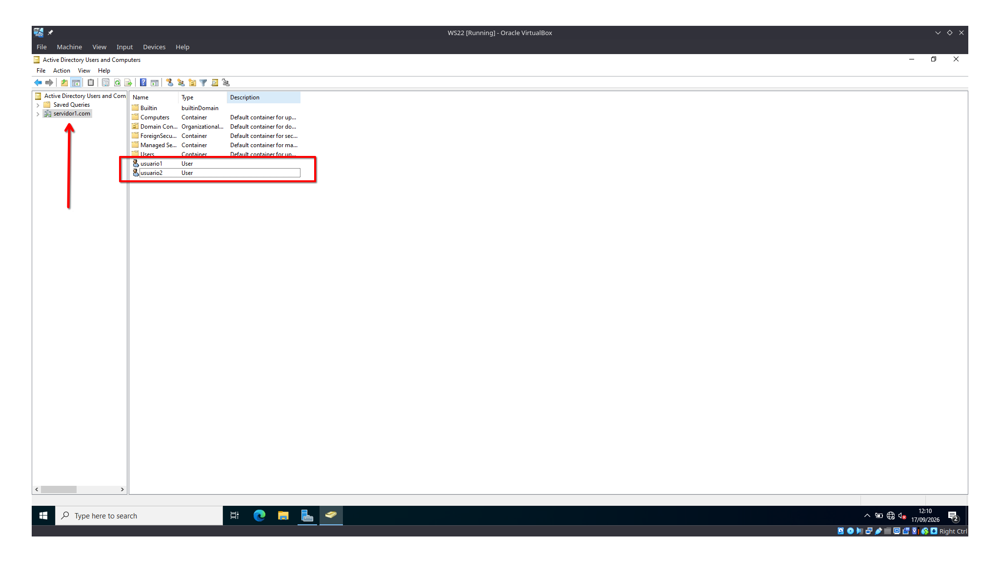
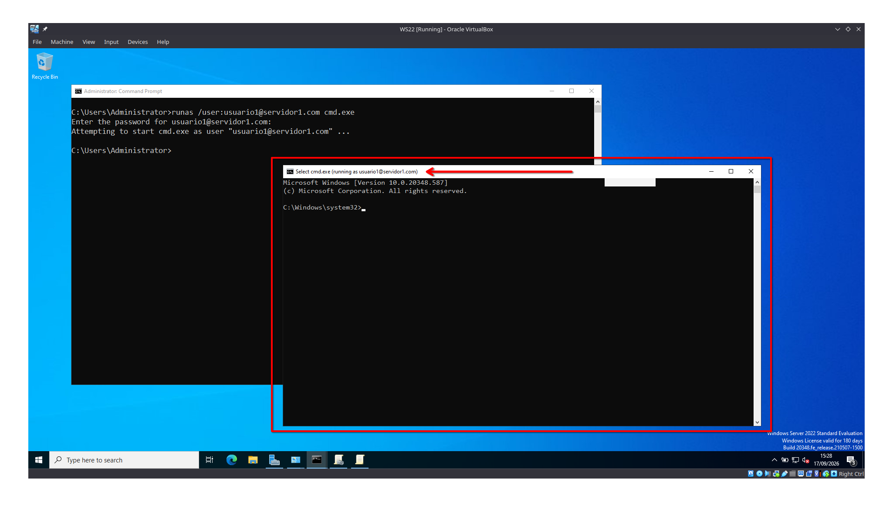
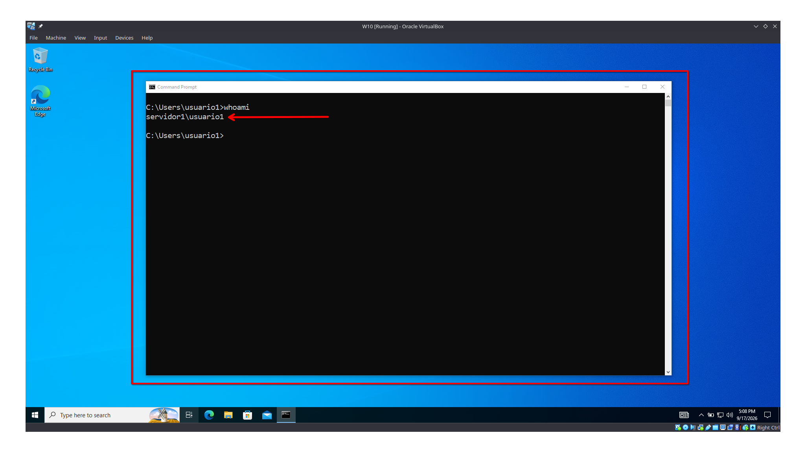

# Actividad en Clase: Virtualización y Active Directory
**Proyecto Final - Fase 1**

- **Fecha**: 17 de agosto de 2026
- **Estudiante 1**: Josué Javier Carrera Soyós
- **Estudiante 2**: Alvaro Javier Paredes Sulá
- **Grupo**: 7
- **Asignatura**: Prácticas Iniciales "C"

## 1. Verificación de la virtualización

Se verificó que las máquinas virtuales estuvieran creadas y en ejecución en VirtualBox: una máquina virtual Servidor con Windows Server 2022 y una máquina virtual Cliente con Windows 10. Ambas máquinas se configuraron con conectividad en modo puente (bridge) para permitir la comunicación en la misma red.


## 2. Configuración del servidor DNS

### 2.1 Instalación del rol DNS

Desde el Administrador del servidor (Server Manager) de Windows Server 2022 se instaló y activó el rol de DNS, junto con el rol de Active Directory Domain Services (AD DS).


### 2.2 Verificación del dominio

Se comprobó la resolución del dominio mediante el comando `ping` hacia `servidor1.com`. Todos los paquetes se enviaron y recibieron correctamente, sin ninguna pérdida, lo que confirma que el dominio resuelve de forma adecuada.


## 3. Instalación de Active Directory Domain Services (AD DS)

Se instaló y activó el rol de Active Directory Domain Services (AD DS) desde el Administrador del servidor (Server Manager) de Windows Server 2022. Este rol se instaló junto con el rol de DNS, como se muestra en la siguiente imagen.


## 4. Creación de las cuentas de usuario

Se creó el `usuario1`, vinculado al dominio `servidor1`.



Posteriormente, se le asignó la contraseña correspondiente.


Se repitió el mismo procedimiento para crear el `usuario2`, también vinculado al dominio `servidor1`. La siguiente imagen muestra ambos usuarios ya creados.



Finalmente, se validó localmente desde el servidor que ambas cuentas están activas y tienen capacidad para iniciar sesión.

## 5. Validación del inicio de sesión

### 5.1 Validación local en el servidor

Desde el servidor WS22 se ejecutó el comando `runas /user:usuario1@servidor1.com cmd.exe` y se ingresó la contraseña correspondiente. El sistema abrió una nueva consola con el título `cmd.exe (running as usuario1@servidor1.com)`, lo que confirma que las credenciales del usuario del dominio son válidas y que la cuenta puede iniciar procesos en el servidor.



### 5.2 Inicio de sesión desde la máquina virtual cliente

Posteriormente, se inició sesión desde la máquina virtual cliente con Windows 10 (W10). En la pantalla de inicio de sesión se seleccionó la opción `Other user` y se ingresaron las credenciales de `usuario1`. La pantalla muestra el texto `Sign in to: SERVIDOR1`, lo que confirma que el equipo cliente reconoce el dominio y que está intentando autenticar contra `SERVIDOR1` y no contra una cuenta local.


El inicio de sesión se completó sin errores y se cargó el escritorio de Windows 10 con el perfil de `usuario1`.

### 5.3 Verificación con `whoami`

Una vez iniciada la sesión en el equipo cliente, se abrió una terminal (Símbolo del sistema) y se ejecutó el comando `whoami` para verificar la identidad efectiva. El resultado fue:

```
servidor1\usuario1
```

Esto demuestra que la sesión activa corresponde efectivamente al usuario del dominio `usuario1` en el dominio `servidor1`, y no a un usuario local. Con ello se valida de extremo a extremo la creación de usuarios, la unión al dominio y la autenticación.


